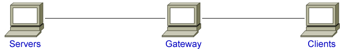
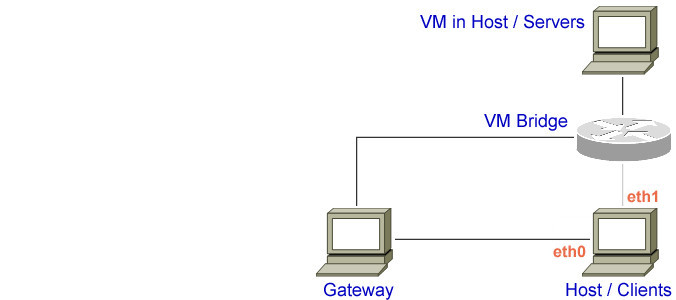

Getting Started
---------------

Downloading algts
*****************

algts has a number of dependencies on other components. Along with the systems you will most likely
deal with every day (the GNU toolchain, Subversion, you programmer editor) you will need to ensure
that the Qt headers and libraries are present on your system before proceeding.

Cygwin users will have to use the Cygwin installer (if you are a Cygwin user, you used it to install
Cygwin). 

From this point forward, we are going to assume that the reader is working in Linux or a Linux
emulation environment (Linux, Cygwin, etc.).

The algts code is available in Subversion repositories on the server http://algts.googlecode.com. 
You can also download a tarball release at http://code.google.com/p/algts/downloads/list. See the
end of this section for instructions on how to get a tarball release.

Downloading algts Using Subversion
++++++++++++++++++++++++++++++++++

One practice is to create a directory called **repos** in one's home directory under which one can
keep local Subversion repositories. *Hint:  we will assume you do this later in the tutorial.*  If
you adopt that approach, you can get a copy of algts by typing the following into your Linux shell
(assuming you have installed Subversion):

::

    cd ~
    mkdir repos
    cd repos
    svn checkout http://algts.googlecode.com/svn/tags/0.1.0/ .

As the svn (Subversion) command executes, you should see something like the following displayed:

::

    A    doc
    A    doc/tutorial
    A    doc/api
    A    doc/api/chm.conf
    A    doc/api/api.conf
    A    src
    A    src/configure
    A    src/test-scripts
    A    src/test-scripts/async-udp-echo.cpp
    A    src/test-scripts/bulk-upload.cpp
    A    src/test-scripts/sample.cpp
    A    src/test-scripts/bulk-download.cpp
    ...
    A    bin
    Checked out revision 144.

After the checkout command completes, you should have three directories named **bin**,  **src** and
**doc**. Go ahead and change into **src** directory. You should see something like the following
there:

::

    configure*  doxygen_index.h   server-daemon/
    core/       emulator-daemon/  test-scripts/

You are now ready to build the algts distribution.

Downloading algts Using a Tarball
+++++++++++++++++++++++++++++++++

The process for downloading algts via tarball is a bit simpler than the Subversion process. You just
have to pick a release, download it and decompress it.

As mentioned above, one practice is to create a directory called **repos** in one's home directory
under which one can keep local Subverion repositories. One could also keep a **tarballs** directory.
*Hint:  the tutorial will assume you downloaded into a* **repos** *directory, so remember the
placekeeper.* If you adopt the **tarballs** directory approach, you can get a copy of a release by
typing the following into your Linux shell (substitute the appropriate version numbers, of course):

::

    cd ~
    mkdir tarballs
    cd tarballs
    wget http://algts.googlecode.com/files/algts-0.1.0-src.tar.gz
    tar xzf algts-0.1.0-src.tar.gz

If you change into the directory **src** you should see a number of files:

::

    configure*  doxygen_index.h   server-daemon/
    core/       emulator-daemon/  test-scripts/

You are now ready to build the algts distribution.

Building algts
**************

Change into the **src** directory you created in the download section above. If you downloaded using
Subversion you should have a directory called **src** under your **~/repos** directory. If you
downloaded using a tarball you should have a directory called something like **algts-0.1.0-src**
under your **~/tarballs** directory. 

Before the first time you build the algts project, you should get the project configured by
typing the following into your Linux shell.

::

    ./configure

Since the building of algts depends on the Qt liberaries, you may get an error message if Qt is
not detected at standard locations.

::

    QTDIR environment variable not set!
    Checking for Qt...QTDIR not set and Qt not found at standard locations!

The message above mostly occurs when you've downloaded and installed QT without installing from the
package management system in your Linux distribution. Now execute **configure** again with a QTDIR
environment variable so that **$QTDIR/bin/qmake** exists. If the QtSDK is installed into a directory
named **qt** in user's home directory, the command would be something like (also remember to
substitute the appropriate version numbers):

::

    QTIDR=~/qt/Desktop/Qt/4.8.0/gcc ./configure

Now the project could be properly configured:

::

      Detected Qt via the QTDIR environment variable...
      Generating Makefile...
      Preparing Script Helper...
    Done

We're now ready for building algts. Take a deep breath and type the following:

::

    make

You will see lots of typical compiler output messages displayed as the build script builds the 
various pieces you downloaded. Eventually you should see the following words:

::

  make[1]:Leaving directory `/home/feng32/repos/src/server-daemon-build'

Once the project has built, you can go ahead and change into the **test-scripts** directory.

::

  cd test-scripts

Running a Script
****************

We typically run scripts with the script helper, which takes care of stuff including generating
project file for the script, building the script, executing the script with specific parameters, 
and cleaning up in a simple way. To run a program, simply use the **--run** option in the script
helper.  Let's run the algts equivalent of the ubiquitous hello world program by typing the
following:

::

  ./script --run hello ""

The script helper first checks to make sure that the program is built correctly and executes a build
if required. The script helper then executes the program, which produces the following output:

::

    Hello algts

Setting Up Environment
**********************

In the previous section, we've built algts and the scripting system is working properly. However
since algts is an emulation based system for studying issues about link sharing gateways, it's
necessary to set up the gateway, the clients in local area network, and the servers on the other
end of the Internet.

Three types of environments are supported by algts:

* The standard environment
* The hardware-in-the-loop environment
* The pure virtual environment

.. note::

    For most users, the pure virtual environment should be the first choice, as no physical
    adapters are required, and the test result is accurate enough in most circumstances.

Setting Up the Standard Environment
+++++++++++++++++++++++++++++++++++

In a standard environment, you should get two linux hosts, one for clients and one for servers, and
a gateway whose QoS settings shall be tested (it is assumed that the algts is built in the client
host). The gateway can be either a transparent x86 Linux router, or a commercial blackbox router.

Connect the client host to the gateway, and the gateway to the server host, and set proper ip 
addresses so that clients and servers can communicate with each other. Assume the wan port address
of your gateway is 10.0.0.2/24, the server host's address is 10.0.0.1/24, now ping the server
from the client host, and you'll see something like the following displayed: 

::

    PING 10.0.0.1 (10.0.0.1) 56(84) bytes of data.
    64 bytes from 10.0.0.1: icmp_req=1 ttl=55 time=2.45 ms
    64 bytes from 10.0.0.1: icmp_req=2 ttl=55 time=1.34 ms
    64 bytes from 10.0.0.1: icmp_req=3 ttl=55 time=2.13 ms
    ^C
    --- 10.0.0.1 ping statistics ---
    3 packets transmitted, 3 received, 0% packet loss, time 0ms
    rtt min/avg/max/mdev = 1.341/1.973/2.459/1.123 ms

For most residential gateway devices, the default local network's address should be 192.168.1.0/24, 
and the client host is likely to have received an ip address like 192.168.1.100 via the DHCP server
built in the gateway. 

The setting above is typical for ordinary users, however since we're to emulate the existance of
multiple users in a single host, additional settings should be applied.

Create a executable file in your home directory:

::

    cd ~
    touch setup-clients.sh
    chmod u+x setup-clients.sh

Then input the scripts below:

::

    #!/bin/sh
    ip addr add dev eth0 192.168.1.8/24
    ip addr add dev eth0 192.168.1.9/24
    ip addr add dev eth0 192.168.1.10/24
    ip addr add dev eth0 192.168.1.11/24
    ip addr add dev eth0 192.168.1.12/24
    ip addr add dev eth0 192.168.1.13/24
    ip addr add dev eth0 192.168.1.14/24
    ip addr add dev eth0 192.168.1.15/24

Now go to the server host and create a similar executable file named **setup-servers.sh** in the 
home directory:

::

    #!/bin/sh
    ip addr add dev eth0 10.0.0.8/24
    ip addr add dev eth0 10.0.0.9/24
    ip addr add dev eth0 10.0.0.10/24
    ip addr add dev eth0 10.0.0.11/24
    ip addr add dev eth0 10.0.0.12/24
    ip addr add dev eth0 10.0.0.13/24
    ip addr add dev eth0 10.0.0.14/24
    ip addr add dev eth0 10.0.0.15/24

Finally we should copy some executable files and libraries from the client host into the server
host.

* The emulator daemon executable
* The server daemon executable
* The Qt4 core library
* The Qt4 network library

Put the file **emulatord** and **serverd** from the **~/repos/bin** directory in your client host
into the home directory in your server host, and the file
**libQtCore.so.4** and **libQtNetwork.so.4** into the **/usr/lib** directory in your server host.

The Qt4 libraries can be found in **$QTDIR/lib**. If the QtSDK is installed into a directory named
**qt** in user's home directory, the path would be something like **~/qt/Desktop/Qt/4.8.0/gcc/lib**.

Setting Up the Hardware-in-the-Loop Environment
+++++++++++++++++++++++++++++++++++++++++++++++

The hardware-in-the-loop environment is similar to the standard environment except that the client
host and the server host lie in the same physical host.

To set up such an environment, we have to put the server into a virtual machine, as it's impossible
to send packets to a local host via an interface that connects to somewhere else. 
Hardware-in-the-loop also means that you have to get at least two ethernet adapters on you client
host.

Assume your ethernet adapters are named **eth0** and **eth1**, **eth0** is connected to the lan port
of your gateway, with an automatic ip address like 192.168.1.100, and **eth1** is connected to the
wan port.

Before going on, delete any existing ip addresses on **eth1**, then execute the command 
``ip addr show dev eth1``, you'll see something like the following displayed: 

::

    3: eth1: <NO-CARRIER,BROADCAST,MULTICAST,UP> mtu 1500 qdisc pfifo_fast state DOWN qlen 500
        link/ether ee:66:97:7d:33:b8 brd ff:ff:ff:ff:ff:ff
        inet6 fe80::ec66:97ff:fe7d:33b8/64 scope link 
         valid_lft forever preferred_lft forever

Notice that no IPv4 addresses are available on **eth1**, which means that TCP or UDP based traffic
from the client host that relies on a IPv4 address will never pass through **eth1**.

Now install a mininal linux distribution into the server host in virtual machine. Modem virtual 
machine softwares like VirtualBox and VMWare support various network configurations including the
**bridged adapter**, which is critical in algts' hardware-in-the-loop environment (and the pure
virtual environment as well). Go to the network configuration page of your new virtual machine, 
and set the network adapter bridged to **eth1**.

The configuration above makes it possible for the server host in virtual machine to communicate with
the gateway.

Finally, insert your downloaded cd image, for example, ubuntu-10.04.4-server-i386.iso, into the 
virtual machine, and start installing.

.. note::

    Evan a clean ubuntu server installation requires more than 500 MB of space. To save more space, 
    an embedded x86 Linux distribution like Voyage is recommended.

The initialization scripts in the hardware-in-the-loop environment are completely the same. Put a
script **setup-clinets.sh** as shown below into the home directory in the client host:

::

    #!/bin/sh
    ip addr add dev eth0 192.168.1.8/24
    ip addr add dev eth0 192.168.1.9/24
    ip addr add dev eth0 192.168.1.10/24
    ip addr add dev eth0 192.168.1.11/24
    ip addr add dev eth0 192.168.1.12/24
    ip addr add dev eth0 192.168.1.13/24
    ip addr add dev eth0 192.168.1.14/24
    ip addr add dev eth0 192.168.1.15/24

And put a script **setup-servers.sh** as shown below into the home directory in the server host:

::

    #!/bin/sh
    ip addr add dev eth0 10.0.0.8/24
    ip addr add dev eth0 10.0.0.9/24
    ip addr add dev eth0 10.0.0.10/24
    ip addr add dev eth0 10.0.0.11/24
    ip addr add dev eth0 10.0.0.12/24
    ip addr add dev eth0 10.0.0.13/24
    ip addr add dev eth0 10.0.0.14/24
    ip addr add dev eth0 10.0.0.15/24

Finally, put **emulatord**, **serverd**, **libQtCore.so.4** and **libQtNetwork.so.4** into the
server host as described in previous section.

There are various ways to get files into a host in the virtual machine:

* Create a cd image containing these files and insert the cd into the virtual machine
* Start a http server in the server host, configure port forwarding settings in the gateway, 
  and download those files from the virtual machine
* Install the VirtualBox/VMWare additions in the server host and share a folder in the client host

For most users that simply want to send files into the virtual machine once, the first method is
recommend as you shall not need additional servers or linux headers that have to be downloaded
elsewhere.

Type the following command to create an iso file for the server host (and replace the qt path when
necessary):

::

    cd ~
    mkdir algtsiso
    cp repos/bin/emulatord algtsiso
    cp repos/bin/serverd algtsiso
    cp qt/Desktop/Qt/4.8.0/gcc/lib/libQtCore.so.4 algtsiso
    cp qt/Desktop/Qt/4.8.0/gcc/lib/libQtCore.so.4 algtsiso
    mkisofs -o algts.iso algtsiso

Setting Up the Pure Virtual Environment
+++++++++++++++++++++++++++++++++++++++

The pure virtual environment makes it possible to test gateways even when there's no physical
network adapter on your host. However to carry out tests, we should first create some virtual
adapters. In Linux, you can create virtual ethernet adapters with the **tunctl** command, which is
included in the "uml-utilities" package.

e.g., In a distribution like Ubuntu, type the command:

::

    sudo apt-get install uml-utilities

Make sure **tunctl** is correctly installed on your system. Then create an executable file named
**setup-tap.sh** with following content:

::

    #!/bin/sh
    tunctl -u root -t tap0
    tunctl -u root -t tap1
    ifconfig tap0 up
    ifconfig tap1 172.16.0.2/24 up

    ip addr add dev tap1 172.16.0.8/24
    ip addr add dev tap1 172.16.0.9/24
    ip addr add dev tap1 172.16.0.10/24
    ip addr add dev tap1 172.16.0.11/24
    ip addr add dev tap1 172.16.0.12/24
    ip addr add dev tap1 172.16.0.13/24
    ip addr add dev tap1 172.16.0.14/24
    ip addr add dev tap1 172.16.0.15/24

    route add -net 10.0.0.0/24 gw 172.16.0.1

Note that we've created two virtual ethernet adapters on the host, **tap0** for the wide area
network, and **tap1** for the local area network. The address of the local area network is set to
172.16.0.0/24 so that addresses for testing the virtual gateway will not contradict the one for 
actually connecting to the Internet.

Similarly, no IPv4 addresses are available on **tap0**, which means that TCP or UDP based traffic
from the client host that relies on a IPv4 address will never pass **tap0**. Also note that we've
created a static route item for the server, so that packets taregeting for the server will be sent
to the gateway.

The network layout in a pure virtual environment is as shown below:

Steps setting up the server is similar. We should first create a virtual machine with the network
bridged to **tap0**, install a mininal linux distribution, put a script **setup-servers.sh** into
the home directory in the server host, and copy files **emulatord**, **serverd**, **libQtCore.so.4**
and **libQtNetwork.so.4** into the server.

The content of **setup-servers.sh** is completely the same compared to the one in previous section:

::

    #!/bin/sh
    ip addr add dev eth0 10.0.0.8/24
    ip addr add dev eth0 10.0.0.9/24
    ip addr add dev eth0 10.0.0.10/24
    ip addr add dev eth0 10.0.0.11/24
    ip addr add dev eth0 10.0.0.12/24
    ip addr add dev eth0 10.0.0.13/24
    ip addr add dev eth0 10.0.0.14/24
    ip addr add dev eth0 10.0.0.15/24

Finally we should set up the gateway in the virtual machine. As mensioned earlier, it is recommended
to use an embedded x86 Linux distribution like Voyage as the operating system of the router.

Create a virtual machine for the gateway with the first network adapter bridged to **tap0**, and
the second bridged to **tap1**. Install the operating system prepared into the virtual hard disk. 

A newly installed system cannot function as a router. To enable NAT, you should execute some
particular iptables commands. For Voyage, this step is simple as you simply needs to execute a
prepared script called **nat.sh**, and the final network configuration file 
**/etc/network/interface** should look like:

::

    auto lo
    iface lo inet loopback
    
    auto eth0
    iface eth0 inet static
            address 10.0.0.2
            netmask 255.255.255.0
            broadcast 10.0.0.255
    
    auto eth1
    iface eth1 inet static
            address 172.16.0.1
            netmask 255.255.255.0
            broadcast 172.16.0.255
            up nat.sh eth1 eth0 "172.16.0.0/24"

